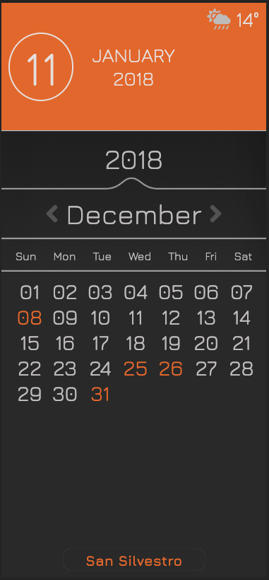

# 	CALENDAR with Moment.js ## 

> 
>
> ##### *:open_file_folder: File Name*:  ajax-ex-calendar :open_file_folder:
>
> 

### :man_teacher: *TASKS* 

Dopo aver generato il calendario, ogni volta che cambio mese dovrò:

1. Controllare se il mese è valido (per ovviare al problema che l’API non carichi holiday non del 2018)
2. Controllare quanti giorni ha il mese scelto formando così una lista
3. Chiedere all’api quali sono le festività per il mese scelto
4. Evidenziare le festività nella lista
5. Trasformare la lista precedente in un vero e proprio calendario, generando una griglia che segua l’andamento dei giorni di un mese a scelta, evidenziando le festività.`
6. Creare dei bottoni che permettano di spostarsi di mese in mese, rigenerando ogni volta la griglia e le festività associate

### :computer: Languages and Libraries:

* HTML

* CSS

* JS

* jQuery

* Ajax

* Handlebars

* Moment.js

  

### :desktop_computer: Project Preview:

> Visit My Github Profile to see other* __Projects__:man_technologist:

## 	https://github.com/AndreaDeMartino

